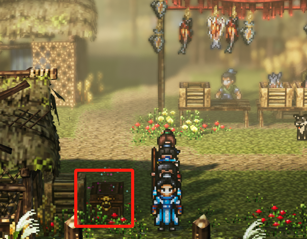

# 资深弟子篇

[TOC]

## 【武当】

### 【门派日常】清剿狼群

对话道微 接受任务。

### 【门派日常】武林挑战

对话元启 接受任务。

击败山门和弟子房门口所有对手。

对话清虚道长会告知青云主人的故事。

### 【主线】平康之行

前往平康城。

### 【平康城】

进城触发剧情 选择 帮他还钱 解锁成就：仗义疏财

战斗结束获得【三转聚灵丹】

前往药铺，给乞丐 张记烧鸡和琼华泉【富贵令】

### 【支线】九炼熊蛇丸

进药铺 对话 郎中张老 选择 这有何难（蛇胆熊胆在蛇洞和断天崖可刷）

再对话 郎中 给他 首乌灵芝。（无人岛收获可得，也可去野外采集）

再对话直到九宫炉，先不继续。

切磋郎中【没药】

找郎中购买 【跌打药】。

前往 王钧家。

夜间直接去博坊，地窖四个宝箱，前往深处。

救出王氏，把地窖深处五个宝箱【一转洗髓丹*2】开了再出去。

剧情后再回平康城。

### 【平康城】

### 【支线】公子相邀

选择 插手

### 【支线】镖局客卿

对话 汪镖头。

前往平康武馆，对话陈麟熙，与武馆师弟、师兄、陈麟熙分别对话战斗7次。

【玄冰神掌秘籍】

切磋武馆师兄【连山掌法秘籍】

### 【支线】北山寒尸

给陈麟熙送礼到60（不能超过69，会影响图鉴收集。）

切磋请教陈麟熙【连山排海秘籍，劈空掌、江湖拳掌】

前往北山村。

## 【北山村】

【临时存档】

此处根据陈麟熙的好感有两个分支图鉴：

1.选择 好言相劝 好感高于70 图鉴【无可挽回】：陈麟熙会死。

2.选择 义正词严 好感低于70 图鉴【心灰意冷】：陈麟熙入队。

推荐让陈麟熙入队，开图鉴两个都要走一遍。

### 【支线】北山寒尸

靠近尸体，选择 义正词严

陈麟熙好感-10（当前50）,前往樊城。

## 【樊城】

### 【支线】镖局客卿

对话蒋镖头。

切磋金顶法王【一转洗髓丹】 打不过就换扇法打。

### 【支线】北山寒尸

走到集市中间往下触发剧情，前往药铺战斗后获得【摔碑手】。

请教切磋斩无刑【六扇心法、玄元经，二转聚灵丹】

若没有惊雷剑法则向斩无刑请教，装备可以薅了。

前往右上角民居触发剧情 选择 相信斩无刑

回平康武馆。

## 【平康城】

### 【支线】平康麟子

对话陈麟熙，前往客栈对话掌柜再回到武馆【通臂拳、寒冰真气秘籍】

给陈麟熙 送礼到60 邀请入队。解锁成就：招募陈麟熙

【临时存档】做完另一个图鉴再读回来。

打造一波装备：

给队友装备 清心护符、红云落日靴、瑞彩祥云袍

分解五品以上装备，出售五品以下装备，批量出售金色品质以下奇珍。

鸣鸿刀打造一把给司马铃。

前往威远镖局。

## 【威远镖局】

### 【支线】镖局客卿

找副总镖头交接一下任务。

### 【支线】威远镖局悬赏

前往饿虎坡，刷一圈武学点，点满队友心法。

击败boss王猛，开启boss宝箱【白虎牌，三转洗髓丹，陨铁矿】

打完回复威远镖局总镖头。

切磋李泰【一转气血丹】

切磋副总镖头【没药】

前往清河村对话村长。解锁成就：白玉虎牌

前往青萝山，击杀五只灰狼，打完回武当。

## 【武当】

对话道微 完成任务。

### 【支线】九炼熊蛇丹

对话道玄 拿到【九宫炉】

### 【主线】平康之行

对话莫问，前往三清殿对话清虚

宇文逸习得 归元心法

请教步微月炼丹

主角任脉除了天突其他点满，接着点冲脉。

队友点出神藏之后全点阳。

### 【主线】再赴平康

与莫问、莫弃交谈，可以薅他们的装备。

前往平康。

## 【平康城】

### 【支线】九炼熊蛇丸

对话郎中，朱砂给他【九炼熊蛇丸】、【九炼熊蛇丸丹方】

（九炼熊蛇丸别吃掉 找道玄交完任务再吃）。

### 【主线】再赴平康

对话客栈郭老、药铺郎中、王有财。

前往北街，战斗后**【烧火棍法秘籍】**

选择 杀了他。【兰儿的玉镯】

（影响品剑大会清霄带队与旧剧情掌门结局）

（若不杀则清虚带队与旧结局无法当掌门）

回到武当。

## 【武当】

### 【支线】九炼熊蛇丸

对话道玄【百花丸】、【百花丸丹方】（拿完丹方就可以吃雄蛇丸了。）

对话清虚，武当夜晚：试剑台左上角宝箱，回弟子房。

*【莫问】好感+20（60）*

### 【支线】莫问的喜好

对话元辰、元启、莫弃 选择 棋盘。

*【元启】送礼至80好感*

### 【紧急任务】天龙暗桩

走到元风附近，前往三清殿，找道玄拿丹药再前往武当山门。

前往程家村。

## 【程家村】

### 【支线】莫问的喜好

对话陆博枭 选择 全力杀枭

*【莫问】好感+20（80）*

前往姑苏城。

## 【姑苏城】

### 【支线】海商赵伦

对话赵伦 选择 答应对方

武馆请教魏继绝**【铁掌】**

前往威远镖局对话李泰 选择 义不容辞

前往连鼓山击杀五个海盗。

*【冷无情】好感+10（35）*

前往双河村。

## 【双河村】

### 【紧急任务】天龙暗桩

对话 胡大望、村长、鱼贩子、老渔夫，选择 迂回询问。

走到右侧出口、码头、鱼铺、鸡窝

触发剧情后去左侧茶摊处 选择 联络，鱼贩子

对话村长 休息片刻。

*冷无情好感+10（45）*

回武当。

## 【武当】

元风接取任务：

### 【门派日常】寻找药材

【中品血灵丹】

### 【门派日常】演武试艺

**【八卦刀法】**

### 【门派日常】宴席准备

### 【门派日常】代送信笺（最后接）

### 【支线】武当元启

（需要元启好感度80）

对话元启选择 去问道妙，对话道妙。

前往六扇门。

## 【六扇门】

触发慕迟剧情【烤栗子*3】，带步微月有额外剧情。

*慕迟好感加10（10）*

触发后先不去找慕迟，这个支线目前难度太高。

去平康城找小吃商人购买烤栗子。

再进六扇门。

切磋仇无道【龙骨】，【上品青灵丹丹方】

对话刘雄，回复元风。

## 【武当】

对话道通 【晋升精英弟子】解锁成就：精英弟子
